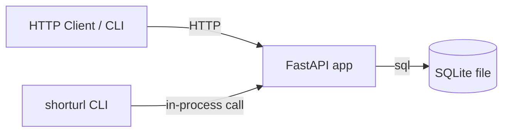

# 02 — Architecture: shorturl

Built from a signed-off `01-requirements.md`. References back to requirement IDs use the long form ("functional requirement FR-1", "non-functional requirement NFR-3") in prose; the short ID alone is fine inside tables.

## 1. Architecture diagram



The FastAPI app handles both the HTTP routes (`/shorten`, `/r/<code>`) and the in-process call from the CLI. The CLI parses argv, calls into the same handler functions the routes use, and prints the result. All persistence goes through one SQLite file (`./shorturl.db`).

## 2. Module list

| # | Module | One-line purpose | Status |
|---|--------|------------------|--------|
| 1 | `shorturl.api` | HTTP route handlers + FastAPI app factory | new |
| 2 | `shorturl.service` | business logic: shorten / resolve / idempotency | new |
| 3 | `shorturl.storage` | SQLite-backed `MappingStore` interface | new |
| 4 | `shorturl.cli` | `shorturl shorten <url>` / `shorturl resolve <code>` | new |

## 3. Per-module public interface

### 3.1 `shorturl.api`

**Purpose:** expose the service over HTTP.

**Interface:**
- `POST /shorten` — body `{"url": "<long>"}` → `200 {"code": "<7 chars>", "short_url": "http://<host>/r/<code>"}`. Non-HTTP(S) URL → `400 {"error": "invalid_url"}`. Body parse error → `400`.
- `GET /r/<code>` — `302 Location: <original>`. Unknown code → `404`.
- `app = create_app(store: MappingStore) -> FastAPI` — factory used by tests to inject an in-memory store.

**Dependencies on other modules:** `shorturl.service` (for the business logic), `shorturl.storage` (injected).

### 3.2 `shorturl.service`

**Purpose:** encode the business rules — URL validation, code generation, idempotency check, code resolution.

**Interface:**
- `shorten(url: str, store: MappingStore) -> Code` — validate URL, check for existing mapping (idempotency), generate code if needed, persist, return code.
- `resolve(code: str, store: MappingStore) -> Optional[str]` — return the original URL or `None`.
- `is_valid_url(url: str) -> bool` — pure function, exported for tests.

**Dependencies on other modules:** `shorturl.storage` (injected).

### 3.3 `shorturl.storage`

**Purpose:** persistence boundary. Hides SQLite behind a small interface so tests can swap an in-memory dict.

**Interface:**
- `class MappingStore(Protocol)`:
  - `get(code: str) -> Optional[str]`
  - `put(code: str, url: str) -> None`
  - `find_by_url(url: str) -> Optional[str]` — for idempotency.
- `class SqliteStore: implements MappingStore` — backed by `./shorturl.db`.
- `class InMemoryStore: implements MappingStore` — for tests.

**Dependencies on other modules:** none.

### 3.4 `shorturl.cli`

**Purpose:** thin wrapper that parses argv and calls into `shorturl.service` directly.

**Interface:**
- `shorturl shorten <url>` — calls `service.shorten`, prints `<code>`.
- `shorturl resolve <code>` — calls `service.resolve`, prints `<original_url>` (or exits 2 if not found).
- Entry point `shorturl = shorturl.cli:main` in `pyproject.toml`.

**Dependencies on other modules:** `shorturl.service`, `shorturl.storage` (constructs the real `SqliteStore`).

## 4. Inter-module connections

- `shorturl.api` → `shorturl.service` — every route handler delegates to `service.shorten` or `service.resolve`.
- `shorturl.cli` → `shorturl.service` — same calls, just from argv.
- `shorturl.api` ↔ `shorturl.storage` — `create_app` accepts a `MappingStore`; production wires `SqliteStore`, tests wire `InMemoryStore`.
- `shorturl.cli` → `shorturl.storage` — CLI constructs `SqliteStore("./shorturl.db")` at startup.

No async messages, no scheduled jobs, no cross-module events. Everything is in-process sync calls.

## 5. Project directory tree

```
project/
├── pyproject.toml                  [NEW]
├── README.md                       [NEW]  (one-paragraph usage)
├── shorturl/
│   ├── __init__.py                 [NEW]
│   ├── api.py                      [NEW]
│   ├── service.py                  [NEW]
│   ├── storage.py                  [NEW]
│   └── cli.py                      [NEW]
└── tests/
    ├── unit/
    │   ├── test_service.py         [NEW]
    │   ├── test_storage_sqlite.py  [NEW]
    │   └── test_cli.py             [NEW]
    └── integration/
        └── test_api_flows.py       [NEW]
```

## 6. Tech stack

| Concern | Choice | One-sentence rationale |
|---------|--------|------------------------|
| Language | Python 3.11+ | matches the user's existing tooling |
| HTTP framework | FastAPI | small surface, good test ergonomics, built-in JSON validation |
| Persistence | SQLite (`sqlite3` stdlib) | one file, no external service, fits non-functional requirement NFR-5 |
| Test framework | pytest + httpx | standard FastAPI testing stack |
| CLI parsing | stdlib `argparse` | no extra dependency for a 2-subcommand CLI |
| Packaging | `pyproject.toml` + `pip install -e .` | standard, no Poetry needed |

## 7. Cross-cutting decisions

- **Logging:** `logging.getLogger(__name__)` per module; one JSON line per request via a FastAPI middleware.
- **Errors:** `service.shorten` raises `InvalidURLError(url)`; the API layer maps it to `400 {"error": "invalid_url"}`. No bare `except`.
- **Config:** `SHORTURL_DB_PATH` env var, default `./shorturl.db`. No other config.

## 8. Risks

| Risk | Likelihood | Mitigation |
|------|------------|------------|
| Code collision (two URLs hash to same code) | low | retry on `UNIQUE` constraint violation; 7-char base62 gives ~3.5T space |
| SQLite write contention at >1k QPS | med | document the limit in README; out of scope to shard now |
| URL validation bypass (javascript:, data:, etc.) | low | reject non-http(s) schemes explicitly in `is_valid_url` |