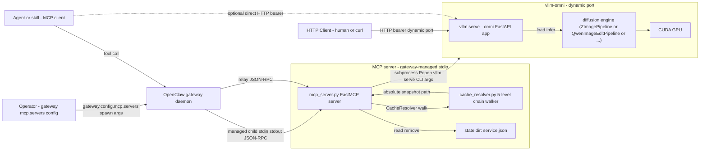

# 02 — Architecture: local-image-gen

## 1. Architecture diagram



The MCP server is a **stdio-spawned process** whose lifetime is owned by the OpenClaw gateway. The gateway spawns it, tracks it, and stops it; the MCP server module itself installs no signal handlers and writes no startup / shutdown logic of its own (its lifecycle is gateway-driven). The MCP server **owns the lifecycle of its own child, the vllm-omni subprocess** (per FR-9): when stdin EOF arrives, the MCP server releases the vllm-omni process it spawned before exiting. The OpenClaw gateway does **not** reach into vllm-omni directly. The agent is one of the gateway's clients and reaches the MCP server's tools only via the gateway's tool-routing layer — the agent never spawns or directly supervises the MCP server or vllm-omni. There is no MCP port or socket; the MCP server communicates with the gateway over its stdin/stdout pipe. vllm-omni is a subprocess spawned by the MCP server; it owns its dynamic port, the loaded diffusion engine, and the GPU memory. Communication between MCP server and vllm-omni is **out-of-band over HTTP** — no in-process call, no IPC socket — the MCP server passes connection details to vllm-omni via **subprocess CLI args** and reads them back from the PID-and-meta file the MCP server itself writes on startup. This separation is required by global single-service invariant (FR-8) and by the dynamic-port design (Goal 3): the MCP server must be able to discover which port a freshly-spawned vllm-omni bound to.

## 2. Module list

| # | Module | One-line purpose | Status |
|---|--------|------------------|--------|
| 1 | `local_image_gen.mcp_server` | Long-lived MCP server: exposes the five MCP tools, walks the 5-level cache lookup chain at `start_service` time, spawns / polls / signals / cleans up a vllm-omni subprocess, writes the PID-and-meta file at the fixed path `${STATE_DIR}/service.json`. | new |
| 2 | `local_image_gen.cache_resolver` | Pure helper module: given `model` (HF-style repo name) and an optional per-call `cache_dir`, walks the 5-level chain and returns `(absolute_snapshot_path, cache_source)`. No I/O outside `os.path.exists` / `os.listdir`; no subprocess, no HTTP. | new |

This is **two modules, not one (and not the v11 four-module layout, which is gone with `model_server.py`).** `cache_resolver.py` is split out as a pure function to keep the MCP server's tool methods small and to make the chain unit-testable without spawning a subprocess.

## 3. Per-module public interface

### 3.1 `local_image_gen.mcp_server`

**Purpose:** expose the five MCP tools over stdio JSON-RPC, walk the 5-level cache lookup chain at `start_service` time, spawn vllm-omni as a subprocess, poll `/v1/models` until ready, track the running service via a single PID-and-meta file, release the subprocess on demand. Holds the global single-service invariant (FR-8).

**HTTP client → vllm-omni:**
On each `invoke_model` call, the MCP server reads `service.json` to get the current `base_url` (`http://127.0.0.1:<port>/v1`) and `bearer_token`, then creates an `openai.OpenAI` client with these values (sync mode). The client is created per-call (lightweight) and not persisted across calls.

**Routing logic for `invoke_model` (FR-4):**
- If `invoke_model` receives `image` or `images`, the MCP server converts the local file path(s) to base64 data URLs and posts to `/v1/images/edits` as `multipart/form-data` (POC-confirmed field names: single image → `image: UploadFile`, multi → `image[]: list[UploadFile]`, prompt → `prompt: str`, mask → `mask_image: UploadFile`, reference → `reference_image: UploadFile`).
- If `invoke_model` receives neither `image` nor `images`, the MCP server posts to `/v1/images/generations` as `application/json`.
- `filename` is not sent to vllm-omni; the MCP server uses it when persisting the returned base64 data to disk (per the v12.4 contract the disk-write step is **always** executed; only rejection paths return without writing). Caller-supplied is required for v12.4 — there is no auto-naming branch.
- `timeoutMs` is not sent to vllm-omni; the MCP server converts it to seconds and passes it as the `timeout` argument to `openai.OpenAI(...)` per-call (e.g. `client.images.generate(..., timeout=timeoutMs/1000)`).
- The MCP server does **not** validate that the running model supports the requested route — that decision is vllm-omni's, and unsupported-shape errors (4xx with OpenAI-shaped `{"error": {...}}` body) are surfaced verbatim. No capability table at the MCP layer.

**Subprocess management:**
- The MCP server spawns vllm-omni with `subprocess.Popen` using a **fresh shell-less** call. The MCP server builds the command line as a list of strings (no `shell=True`), with **CLI args** (not env vars) for all model-server-specific settings.
- The MCP server reads vllm-omni's stdout/stderr to its own stderr (unified log capture; stdout is reserved for the MCP JSON-RPC stream per FR-7).
- The MCP server polls `http://127.0.0.1:<port>/v1/models` every 1 s after bind, with an `Authorization: Bearer <token>` header, until the response body indicates ready or the start timeout elapses. The exact pre-ready vs ready response shape is pending end-to-end POC calibration (see 01-requirements.md §8 Open Questions); vllm-omni 0.22.0 source confirms an omni-aware handler is installed at `/v1/models` (`vllm_omni/entrypoints/openai/api_server.py:452`) and returns 200 with the loaded model card once the diffusion engine reports ready.
- The MCP server picks the OS-assigned free port via the standard `socket.bind((host, 0)); socket.getsockname()[1]` trick, then **passes `--port <port>` to `vllm serve`**. (vllm-omni 0.22.0 does not accept `--port 0`; the MCP server picks a free port itself before spawning.)

**Interface (MCP tools — exactly five, all `must` priority in FR-1 to FR-5):**
- `list_local_models() -> [{model, current_load_status}]`
  - `current_load_status ∈ {not_loaded, loading, loaded}` per FR-1.
  - v1 supports **any model id vllm-omni can load**; the reference fixture is `Tongyi-MAI/Z-Image-Turbo`. The set of recognized model ids is determined by which models resolve to a snapshot directory in the 5-level cache lookup chain at scan time — there is no hardcoded allow-list in v1. Multi-model discovery from a manifest is deferred to v2 (see 01-requirements.md §8 Open Questions).
  - `current_load_status` is computed by intersecting the resolved model set with the live PID-and-meta file (single-service invariant ⇒ at most one of `loading` / `loaded`).
- `start_service(model: str, cache_dir: str | None = None, timeoutMs: int | None = None) -> {model, pid, port, started_at, bearer_token, cache_source, model_path} | {error: {code, message}}`
  - If a model-service is already running (global single-service, FR-8), fails fast with `service_already_running`; the error message surfaces the existing service's `model` (not a `service_id`, which no longer exists). No subprocess is spawned, no PID-and-meta file is touched.
  - **5-level cache lookup chain** (FR-3, authoritative resolver = MCP server):
    1. HuggingFace cache env var (`HF_HOME` or `HUGGINGFACE_HUB_CACHE`), expecting `<hub-root>/models--<org>--<repo>/snapshots/<sha>/`.
    2. Default HuggingFace cache (`~/.cache/huggingface/hub/`) with the same layout expectation.
    3. ModelScope cache env var (`MODELSCOPE_CACHE`), expecting `<hub-root>/models/<org>/<repo>/`.
    4. Default ModelScope cache (`~/.cache/modelscope/hub/`) with the same layout expectation.
    5. User-supplied `cache_dir` (per-call override) — the resolver probes the directory's contents to choose the layout: if `<cache_dir>/models--<org>--<repo>/snapshots/...` exists, treat as HuggingFace; otherwise if `<cache_dir>/models/<org>/<repo>/` exists, treat as ModelScope.
    - First match wins. The resolved absolute path is the positional `<model>` argument passed to `vllm serve`. The resolver writes the winning level to `service.json` as `cache_source` (one of `hf_env` | `hf_default` | `ms_env` | `ms_default` | `cache_dir`) — this is the **single source of truth** for which level served the load.
    - **Modelscope bridging — POC-verified scheme B (2026-06-30T22:00):** vllm-omni 0.22.0 reads the `<model>` positional as a local path and **accepts the standard ModelScope layout (`models/<org>/<repo>/`) as-is**, detecting the diffusers pipeline via `model_index.json` at the root and dispatching the right pipeline class (verified with Z-Image-Turbo: `ZImagePipeline` auto-detected). No bridge / symlink / hardlink / scratch directory layer is required in v1. Schemes A and C are archived only as v2 fallback options.
  - **vllm-omni subprocess launch** (CLI args, not env vars):
    - `<absolute_snapshot_path> --omni --port <port> --host 127.0.0.1 --api-key <bearer_token>` plus any additional operator-required flags forwarded from the gateway's MCP server config.
    - The `--omni` flag is **required** to put vllm in diffusion mode; the flag is hidden from `vllm serve --help=all` but is documented in `vllm_omni/entrypoints/cli/serve.py` and present in `OmniConfig`. Without `--omni`, vllm's `ModelConfig` rejects ModelScope paths because they have `model_index.json` not `config.json` at the root.
    - The `--api-key` flag is **required** (NFR-5 + FR-3 v12.1); vllm upstream wires it into a FastAPI `AuthenticationMiddleware` that protects every route including `/v1/images/generations` and `/v1/images/edits`. There is no fallback to a loopback-only un-authenticated configuration.
    - The MCP server passes `--host 127.0.0.1` defensively even though `--api-key` is set (defense in depth — keeps vllm-omni off the LAN if the operator's environment changes).
  - **Pre-spawn existence check:** the resolver walks the same 5 levels and returns `model_not_found` immediately if none contains the model. This is a fast fail-fast for the obvious "model not on disk" case so the agent sees a clean error without waiting for a subprocess to spawn and fail. The MCP server does **not** make a binding decision about which level will win at this stage — that decision is finalized in the resolution step above (which is the same walk; the pre-check is an early-return when the walk yields nothing).
  - **Readiness polling:** the MCP server polls `GET /v1/models` with `Authorization: Bearer <token>` every 1 s after bind, until the response indicates ready or the start timeout elapses. The `timeoutMs` argument, when supplied and > 0, overrides the hardcoded default 120 s start timeout for this single call; if omitted, 120 s applies (raised from 30 s in v11 per owner decision 2026-06-30T21:32, to absorb vllm-omni's diffusers-format pipeline warm-up + CUDA graph compile time). On timeout, the subprocess is terminated, no PID-and-meta file is written, and the call returns `start_timeout`.
  - **PID-and-meta file write:** on success, the MCP server itself (not vllm-omni) writes `${STATE_DIR}/service.json` atomically (`tempfile` + `os.replace`) with `{model, pid, port, started_at, bearer_token, cache_source, model_path}`. The MCP server knows all of these because it is the cache resolver and the subprocess launcher. **`model_path` is the absolute snapshot path that was passed to `vllm serve`** (audit trail).
- `list_running_services() -> [{model, pid, port, started_at, status}]`
  - `status ∈ {loading, ready}` per FR-2 / NFR-8.
  - **v12.1: no `service_id` field.** Returns 0 entries if no service is running (single-service invariant ⇒ at most one entry; in practice the agent will see 0 or 1).
  - Prunes stale PID-and-meta files before responding (FR-2); uses `kill -0` (or `os.kill(pid, 0)`) to validate PID liveness.
  - Reads the fixed path `${STATE_DIR}/service.json` (no glob — single-service invariant ⇒ at most one file).
- `invoke_model(prompt: str, filename: str, model: str | None = None, image: str | None = None, images: list[str] | None = None, size: str | None = None, outputFormat: str = "png", count: int = 1, negative_prompt: str | None = None, num_inference_steps: int | None = None, guidance_scale: float | None = None, true_cfg_scale: float | None = None, seed: int | None = None, timeoutMs: int | None = None) -> {path: str, b64_json: str | list[str], ...} | {error: {code, message}}` — 14 args (v12.4; `prompt` + `filename` are positional-without-default and ordered left-aligned; `path` is always present in the success return).
  - **Argument semantics** (aligned with OpenClaw's built-in `image_generate`):
    - `prompt` (required) — image generation / edit prompt. Empty string is a validation error.
    - `model` (optional) — the desired model's HF-style repo name; **defaults to whichever service is currently running** under v1's single-service invariant. If supplied, the MCP server verifies the running service's `model` field matches and returns `model_not_loaded` on mismatch (no auto-start).
    - `image` (optional) — single reference image path/URL for edit (img2img / inpainting); sent as the `image` multipart field for `/v1/images/edits` (POC-confirmed field name).
    - `images` (optional) — list of reference image paths/URLs for edit or style reference; sent as the `image[]` multipart fields for `/v1/images/edits` (POC-confirmed field name; alias `image_array` also accepted).
    - `filename` (required positional; v12.5 — no default, second positional after `prompt`). Resolution:
      3. **Parent directory must already exist** on disk. If `Path(filename).parent` does not exist → reject `filename_dir_not_found` (HTTP 400-shaped, no vllm-omni contact). The MCP server never creates parent directories (owner decision 2026-07-01T00:19). If the parent exists but is not writable → `media_dir_unwritable` (HTTP 500-shaped) with the underlying `OSError` errno.
      4. **Target paths** are computed by splitting `filename` into `<stem>` / `<ext>` via `Path(filename).stem` / `.suffix`. For `count=1` the target is `<filename>`. For `count=N>1` the targets are `<stem>-1.<ext>`, `<stem>-2.<ext>`, …, `<stem>-N.<ext>` (no zero-padding). All targets are checked against disk before vllm-omni is contacted; any existing target → `filename_conflict` (HTTP 400-shaped).
    - `size` (optional) — `WxH` literal matching vllm-omni's wire protocol, e.g. `"1024x1024"`, `"1152x896"`, `"1280x720"`. The MCP server does **not** pre-validate the value — the specific valid set depends on the running model and vllm-omni returns 4xx for unsupported sizes. For Z-Image-Turbo the canonical default is `"1024x1024"`.
    - `outputFormat` (optional, default `"png"`) — `"png"` | `"jpeg"` | `"webp"`. vllm-omni's `/v1/images/generations` only supports `response_format: b64_json` regardless of `outputFormat`; the `outputFormat` value controls the **decoded bytes** format returned to the caller. `/v1/images/edits` has a native `output_format` parameter; the MCP server forwards the same value there.
    - `count` (optional, default 1) — image count 1-N (exact N TBD at module-design time). Under v1 single-service invariant, multiple images are produced serially by the same service and returned together in a single response. The response shape is `{path: list[str] (len=count), b64_json: list[str] (len=count)}` when `count>1`, and `{path: str, b64_json: str}` when `count=1`. **v12.5 contract for `count>1` + caller-supplied `filename`:** the targets are `<stem>-1.<ext>` … `<stem>-N.<ext>` (see `filename` rule 4);
    - **`negative_prompt`** (optional, default `None`) — text describing what to avoid in the image. Forwarded verbatim to vllm-omni as the `negative_prompt` field on both `/v1/images/generations` (JSON body) and `/v1/images/edits` (multipart). Source-of-truth field name and default come from the [vllm-omni `image_generation_api` page](https://docs.vllm.ai/projects/vllm-omni/en/stable/serving/image_generation_api/) "vllm-omni Extension Parameters" table (web_fetch 2026-06-30T23:17); the same field exists on the [`image_edit_api` page](https://docs.vllm.ai/projects/vllm-omni/en/stable/serving/image_edit_api/) for the edits endpoint. Type: string. When `None`, the field is omitted and the model uses its own default.
    - **`num_inference_steps`** (optional, default `None`) — number of diffusion steps. Forwarded verbatim as `num_inference_steps` on both endpoints (JSON body key on `generations`, multipart field on `edits`). Type: integer. When `None`, the field is omitted and the model uses its own default.
    - **`guidance_scale`** (optional, default `None`) — classifier-free guidance scale; typical range documented as `0.0–20.0`, but the MCP server does **not** enforce that range — the value is forwarded as-supplied and any range / type error surfaces verbatim from vllm-omni. Forwarded as `guidance_scale` on both endpoints. Type: float. When `None`, the field is omitted and the model uses its own default.
    - **`true_cfg_scale`** (optional, default `None`) — True CFG scale. **Model-specific** — vllm-omni documents this as "may be ignored if not supported". Forwarded verbatim as `true_cfg_scale` on both endpoints. Type: float. When `None`, the field is omitted and the model uses its own default.
    - **`seed`** (optional, default `None`) — random seed for reproducibility. Forwarded verbatim as `seed` on both endpoints. Type: integer. When `None`, the field is omitted and the model uses its own default. (Differs from the OpenClaw built-in `image_generate` tool, which does not expose `seed`; this skill surfaces it because vllm-omni supports it at the wire layer.)
  - **Lookup mechanism:** the MCP server reads `${STATE_DIR}/service.json`, validates PID liveness with `kill -0`, and returns a `no_running_service` error if absent or dead. If alive, the MCP server verifies its `model` field matches the supplied `model` argument (or matches anything if `model` was omitted); mismatch returns `model_not_loaded`. On match, the MCP server reads `bearer_token`, `port`, and other fields from the file and forwards the request to `http://127.0.0.1:<port>/v1/images/{generations|edits}` with the `Authorization: Bearer <token>` header.
  - Forwards `Authorization: Bearer <token>` to vllm-omni using the bearer token from `service.json`. Hardcoded 120 s invoke timeout (per-call override via `timeoutMs`).
  - Returns `{path: str, b64_json: str | list[str], ...}` (the `path` is **always** present per the v12.3 file-persistence contract; `b64_json` is a single string for `count=1` and a list for `count>1`) alongside any vllm-omni usage metadata. The file at `path` is the decoded bytes (decoded into the requested `outputFormat` on top of the b64-json bytes vllm-omni returned).
- `release_service(model: str) -> {released: bool, model, pid, port} | {error: {code, message}}`
  - **Lookup mechanism:** the MCP server reads `${STATE_DIR}/service.json`, prunes it if PID is not alive (idempotent release of a stale record), and returns `no_running_service` if absent. If present, verifies its `model` field matches the argument; mismatch returns `model_not_loaded`.
  - On match: the MCP server sends `SIGTERM` to the vllm-omni PID, waits up to the hardcoded 10 s release-grace timeout for graceful shutdown, then `SIGKILL` if still alive. The PID-and-meta file is removed before responding. If the process is already dead, the stale file is removed and the call returns success (idempotent).
  - Response shape: `{released: true, model, pid, port}` — no `service_id` field.

**Interface (process boundary):**
- **Env vars** read on startup (only two skill-specific, per owner decision 2026-06-28 23:39 + 2026-06-29 00:13):
  - `LOCAL_IMAGE_GEN_BEARER_TOKEN` (auto-generated `secrets.token_urlsafe(32)` if unset).
  - `LOCAL_IMAGE_GEN_STATE_DIR` (default `~/.local-image-gen/state/`).
  - The cache lookup chain relies on the **standard library env vars** (inherited from the gateway environment, **not** set by this skill): `HF_HOME` / `HUGGINGFACE_HUB_CACHE` (HuggingFace), `MODELSCOPE_CACHE` (ModelScope). `LOCAL_IMAGE_GEN_MODEL_PATH` was removed in 2026-06-29 — there is no skill-specific model-path override; per-call override is the `cache_dir` argument to `start_service`.
- **stdio transport** (FR-7): reads JSON-RPC requests from stdin, writes JSON-RPC responses to stdout. No listening port, no network socket. The MCP server's lifetime is owned by the OpenClaw gateway (not by the MCP server itself); the gateway decides when to start / stop the MCP server.
- On startup: validates state directory (`mkdir -p` if missing), prunes the fixed `service.json` if its PID is not alive, walks all 5 cache levels to record which level (if any) holds each resolved model name — for diagnostics and to seed `list_local_models` results. The MCP server does **not** fail-fast if no level contains a model name — that error surfaces only when `start_service` is called. The walk on startup is a **read-only directory scan** (it does not load any model and does not bind any decision about which level will win); the resolver is the authoritative resolver at `start_service` time.
- On **stdin EOF** (FR-9, lifecycle delegation from the gateway): the gateway closing stdin is the only shutdown signal the MCP server sees. The MCP server stops accepting new tool calls, releases any running model-service per FR-5 (SIGTERM, SIGKILL fallback after hardcoded 10 s grace, PID-and-meta file removal), then exits 0. Hardcoded 30 s shutdown timeout; on timeout, SIGKILL on vllm-omni and exit non-zero. No SIGTERM / SIGHUP handlers are installed on the MCP server — stdin EOF is the only signal. **The MCP server is responsible for cleaning up the vllm-omni subprocess it spawned; the OpenClaw gateway does not reach into vllm-omni directly.**

**Dependencies on other modules:** `local_image_gen.cache_resolver` (the 5-level chain walker). Talks to vllm-omni over HTTP using the **`openai.OpenAI` client** (sync mode). The client is configured with `base_url=http://127.0.0.1:<port>/v1` and `api_key=<bearer-token-read-from-service.json>`. vllm-omni's OpenAI-compatible HTTP endpoint (FR-6) is the wire format, so using the official `openai` Python client avoids hand-rolled HTTP plumbing (base_url / auth header / retry / timeout). For `/v1/images/edits` the MCP server needs to construct the multipart body itself (the `openai` Python client's `images.edit` helper supports multipart, but the vllm-omni-specific field names `image` / `image[]` are passed via `extra_body` or directly via `httpx` if the official client doesn't expose them; see §6 Tech Stack for the final decision). (`httpx` is a transitive dependency of the `openai` package — the MCP server does not import it directly unless the multipart path needs it.)

### 3.2 `local_image_gen.cache_resolver`

**Purpose:** pure function that walks the 5-level cache lookup chain for a given `model` and returns `(absolute_snapshot_path, cache_source)`. No subprocess, no HTTP, no model loading. No state beyond the chain arguments.

**Interface:**
- `resolve(model: str, cache_dir: str | None = None) -> (absolute_snapshot_path: str, cache_source: Literal['hf_env', 'hf_default', 'ms_env', 'ms_default', 'cache_dir']) | None`
- `walk_levels() -> list[CacheLevel]` — diagnostic helper returning the 5 levels in walk order with the env-var-resolved roots, for startup logging.
- `CacheLevel` is a frozen dataclass: `{name: str, root: str, layout: Literal['hf', 'ms'], snapshot_for(model: str) -> str | None}`.

**Resolution rules (FR-3):**
- Level 1-4 walk in fixed order; level 5 (`cache_dir`) is appended only if `cache_dir` is supplied.
- For levels 1-4: `HF_HOME` if set, else `HUGGINGFACE_HUB_CACHE` if set, else `~/.cache/huggingface/hub/`. Similarly `MODELSCOPE_CACHE` if set, else `~/.cache/modelscope/hub/`.
- Layout per level is fixed (HF levels → `models--<org>--<repo>/snapshots/<sha>/`; MS levels → `models/<org>/<repo>/`). The resolver probes for the existence of the expected directory using `os.path.exists` / `os.listdir`.
- Level 5 (`cache_dir`): layout is auto-probed — if `<cache_dir>/models--<org>--<repo>/snapshots/...` exists, treat as HF; otherwise if `<cache_dir>/models/<org>/<repo>/` exists, treat as MS.
- First match wins. `cache_source` reflects which level won.
- If no level matches, return `None`. The MCP server maps `None` to a `model_not_found` error.

**Dependencies on other modules:** none. Stdlib only.

## 4. Inter-module connections

- **Process boundary, not in-process calls.** The MCP server spawns vllm-omni as a subprocess and communicates with it over HTTP. There is no shared Python module, no in-memory state.
- **In-process call.** The MCP server calls `cache_resolver.resolve(...)` directly at `start_service` time; this is a synchronous pure function call within the same Python process.
- **Subprocess launch.** The MCP server uses `subprocess.Popen` with a fresh shell-less call. **CLI args** passed (not env vars): `<absolute_snapshot_path> --omni --port <port> --host 127.0.0.1 --api-key <bearer_token>`. The MCP server picks the OS-assigned free port itself before spawning (vllm-omni 0.22.0 does not accept `--port 0`); uses the standard `socket.bind((host, 0)); socket.getsockname()[1]` trick. vllm-omni inherits the MCP server's environment (especially `CUDA_VISIBLE_DEVICES`, `HF_HOME` / `HUGGINGFACE_HUB_CACHE`, `MODELSCOPE_CACHE`, `PATH`). Port discovery: the MCP server already knows the port (it picked it); the PID-and-meta file includes it as `port` for cross-reference and crash recovery.
- **Bearer-token handoff.** The MCP server generates (or accepts) a bearer token at startup and passes it to vllm-omni via the `--api-key` CLI arg. vllm upstream wires this into a FastAPI `AuthenticationMiddleware` that protects all routes (source-verified at `vllm/entrypoints/openai/api_server.py:265-269`). The MCP server itself reads the token back from the PID-and-meta file when it needs to call `invoke_model` (so it can forward the `Authorization` header).
- **No async / no shared thread.** The MCP server's stdio transport and tool dispatch are synchronous. vllm-omni handles one HTTP request at a time at the FastAPI handler level but the underlying engine is async; the MCP server does not care — it uses the sync `openai.OpenAI` client and trusts vllm-omni to queue requests in FIFO order within its single uvicorn worker.
- **No persistence beyond state dir.** No database, no message broker. The state dir holds only the fixed `service.json` for the current service (v1 single-service ⇒ at most one file at any time) and any operator-supplied `cache.json` (diagnostics, optional, not on critical path).

## 5. Project directory tree

Project root is `~/.openclaw/skills/local-image-gen/` (owner-decided). Layout uses `<project-root>/` as the variable; below is the actual concrete layout.

```
<project-root>/
├── pyproject.toml                         [NEW] — Python package metadata, console scripts
├── README.md                              [NEW] — short usage + OpenClaw gateway mcp.servers config example
├── .env.example                           [NEW] — sample env vars with comments (3 only: BEARER_TOKEN, STATE_DIR, plus a comment about inheriting HF/MODELSCOPE env vars)
├── local_image_gen/
│   ├── __init__.py                        [NEW] — package marker, __version__
│   ├── mcp_server.py                      [NEW] — module 1 (FastMCP server, stdio transport, subprocess lifecycle, bearer-token handoff)
│   └── cache_resolver.py                  [NEW] — module 2 (pure 5-level chain walker)
└── tests/
    ├── unit/
    │   ├── test_mcp_server.py             [NEW] — MCP server tool tests, single-service invariant, stdio JSON-RPC framing
    │   └── test_cache_resolver.py         [NEW] — chain walk order, level-5 layout probe, missing-model → None
    └── integration/
        ├── test_spawn_lifecycle.py        [NEW] — start_service → ready → invoke_model → release_service; service.json lifecycle
        ├── test_global_single_service.py  [NEW] — second `start_service` returns `service_already_running` and surfaces the existing service's `model` (FR-8)
        └── test_stdio_transport.py        [NEW] — spawn mcp_server.py via stdin/stdout JSON-RPC, validate tool calls
```

The state directory (`${LOCAL_IMAGE_GEN_STATE_DIR}`, default `~/.local-image-gen/state/`) and the model cache live **outside** the project root. The model is loaded by vllm-omni reading from the absolute snapshot path the MCP server passes as the positional `<model>` argument to `vllm serve` — by default `/home/cxt/.cache/modelscope/hub/models/Tongyi-MAI/Z-Image-Turbo` (per prototype `~/.openclaw/workspace/z_image_turbo_poc.py`). The project root contains only code, tests, and docs.

## 6. Tech stack

| Concern | Choice | One-sentence rationale |
|---------|--------|------------------------|
| Language | Python 3.11+ | locked by NFR-6 |
| Model-server harness | **`vllm serve --omni <path>`** (vllm-omni 0.22.0) | POC-verified to load diffusers-format pipelines (incl. ModelScope layout) and expose an OpenAI-compatible HTTP endpoint with bearer-token auth |
| MCP framework | FastMCP (`mcp` package on PyPI) | the de facto Python MCP server library; minimal boilerplate |
| HTTP client (MCP → vllm-omni) | `openai.OpenAI` (sync mode) | vllm-omni exposes an OpenAI-compatible Images API, so using the official `openai` Python client is more idiomatic than hand-rolled `httpx` POSTs — handles `base_url`, `Authorization: Bearer <token>`, request body, and error surfacing for free; sync mode fits the stdio transport (no asyncio runtime needed in the MCP server) |
| Multipart construction (`/v1/images/edits`) | `openai.OpenAI` client's `images.edit(...)` for the standard fields; `extra_body` or direct `httpx` for vllm-omni-specific field names (`image` / `image[]`) if the official client doesn't expose them | POC-verified field names: `image`, `image[]` (alias `image_array`), `mask_image`, `reference_image`, `prompt`, `model`, `n`, `size`, `response_format`, `output_format`, **`negative_prompt`, `num_inference_steps`, `guidance_scale`, `true_cfg_scale`, `seed` (v12.2; MCP surfaces all five from `invoke_model`), `strength`, `lora`** |
| Subprocess management | stdlib `subprocess.Popen` | no external dep needed; Popen object gives us pid + signal hooks |
| Atomic file writes | `tempfile` + `os.replace` | POSIX-atomic rename for PID-and-meta files |
| Test framework | pytest + pytest-asyncio | standard stack; pytest-asyncio is needed for FastMCP tool tests that mock the subprocess. (`httpx` is no longer an explicit dev dependency — it comes in transitively via the `openai` package if any test mocks at the HTTP layer; tests that exercise the MCP server talk to it via stdio JSON-RPC, and integration tests can stub `subprocess.Popen` or run against a real vllm-omni on a free port.) |
| Config | env vars only (no config file) | matches NFR-7 (no external services) and keeps ops simple |
| Packaging | `pyproject.toml` + `pip install -e .` | standard; entry point: `local-image-gen-mcp` (stdio, invoked by the OpenClaw gateway as one of its managed subprocess children). vllm-omni is **not** a Python dependency of this skill — it is installed on the host as a separate package and invoked via the `vllm` CLI; the MCP server only needs to be able to find it on `PATH`. |
| Runtime deps | `mcp` (FastMCP) + `openai` + stdlib | one dependency row; the MCP server has no model-loading code. `httpx` is no longer pinned explicitly — it comes in transitively via `openai`. |

## 7. Cross-cutting decisions

- **Logging (NFR-4):** stdlib `logging` configured with a JSON formatter. One logger per module (`local_image_gen.mcp_server`, `local_image_gen.cache_resolver`). Each lifecycle event and tool invocation emits exactly one JSON line. **MCP server writes to stderr** (stdout is reserved for the JSON-RPC stream — FR-7); vllm-omni writes to its own stdout/stderr, which the MCP server redirects to its own stderr for unified log capture. No rotating file handler in v1.
  - **Startup logs** include the resolved `LOCAL_IMAGE_GEN_STATE_DIR`, the bearer-token-source (`env` or `auto-generated`), and the 5-level cache lookup order (resolved roots + layouts).
  - **Per-`start_service`** logs include the resolved `model`, the resolved `model_path` (the absolute path passed to `vllm serve`), the requested `timeoutMs` (or the hardcoded 120 s default when omitted), and `cache_source`.
  - **Per-`invoke_model`** logs include `model` (lookup argument), the matched service record's `model` + `pid` + `port` (forwarded from `${STATE_DIR}/service.json`), `cache_source`, the routed endpoint (`generations` vs `edits`), and the vllm-omni HTTP status / first error line (if any).
  - **Per-`release_service`** logs include the requested `model`, the resolved service record's `model` + `pid` on success, and the release duration / signal used.
  - **Per-`list_local_models` / `list_running_services`** logs include the returned count and, for `list_running_services`, the matched `model` + `pid` + `status`.
- **Errors:** vllm-omni returns standard OpenAI-shaped JSON error bodies (`{"error": {"message": ..., "type": ..., "code": ...}}`) on 4xx/5xx; the MCP server surfaces these **verbatim** to the MCP tool caller (FR-4: "errors are normal, expected, and surfaced unchanged"). The MCP server returns MCP-shaped tool errors with a structured `error` field containing `code` and `message` (e.g. `{"error": {"code": "start_timeout", "message": "vllm-omni did not become ready within 120 s"}}`). The MCP server never crashes on a tool error; it logs and returns.
- **Config / env vars (only two skill-specific, per owner decision 2026-06-28 23:39 + 2026-06-29 00:13 — mcp走stdio模式 + cache-only):**
  - `LOCAL_IMAGE_GEN_BEARER_TOKEN` (default: auto-generated `secrets.token_urlsafe(32)` at MCP server startup) — NFR-5.
  - `LOCAL_IMAGE_GEN_STATE_DIR` (default `~/.local-image-gen/state/`) — FR-2, FR-3.
  - **Cache resolution uses standard library env vars, inherited from the gateway's environment** (`HF_HOME` / `HUGGINGFACE_HUB_CACHE` for HuggingFace, `MODELSCOPE_CACHE` for ModelScope) — FR-3. The skill does not set its own cache env vars. `LOCAL_IMAGE_GEN_MODEL_PATH` was removed in 2026-06-29; per-call override is the `cache_dir` argument to `start_service`.
  - **All timeouts are hardcoded** (start 120 s, invoke 120 s, release grace 10 s, shutdown 30 s) — see FR-3, FR-4, FR-5, FR-9. Not operator-overridable via env vars in v1; per-call overrides exist on `start_service(timeoutMs=...)` and `invoke_model(timeoutMs=...)` (FR-3, FR-4). NFR-2 was removed in 2026-06-29 since the start-timeout guarantee is now part of FR-3.
- **OpenClaw gateway configuration (`gateway.config.mcp.servers`, owner-visible):** the operator adds an entry to the OpenClaw gateway's `mcp.servers` config telling the gateway how to spawn `mcp_server.py`. Example shape:
  ```json
  {
    "mcp": {
      "servers": {
        "local-image-gen": {
          "command": "python3",
          "args": ["-m", "local_image_gen.mcp_server"],
          "env": {
            "LOCAL_IMAGE_GEN_BEARER_TOKEN": "<token-or-auto>",
            "LOCAL_IMAGE_GEN_STATE_DIR": "<path-or-default>"
          }
        }
      }
    }
  }
  ```
  The gateway manages this subprocess child: it starts it on gateway startup, tracks it, and terminates it on gateway shutdown. The MCP server module itself contains no equivalent logic. **Cache configuration is inherited from the gateway's environment** (`HF_HOME` / `HUGGINGFACE_HUB_CACHE` / `MODELSCOPE_CACHE`); the skill does not set its own cache env vars. **vllm-omni is on `PATH`** — the gateway does not pass `vllm` as a managed child; the MCP server spawns it directly when needed.
- **State directory lifecycle:** created on MCP server startup with `mkdir(parents=True, exist_ok=True)`. The fixed `service.json` is written atomically by the MCP server (write to `.tmp`, rename). Stale-file pruning (FR-2) runs on every `list_running_services` call AND on MCP server startup.
- **Bearer token flow:** the token is generated (or accepted) by the MCP server once at startup and passed to vllm-omni via the `--api-key` CLI arg (cross-reference §4). vllm upstream wires `--api-key` into a FastAPI `AuthenticationMiddleware` that protects all routes including `/v1/images/generations` and `/v1/images/edits`. The MCP server reads the token back from `service.json` when it needs to call `invoke_model` (so it can forward the `Authorization` header). v1: no rotation, no expiry, no scoping.
- **In-flight serialization:** vllm-omni's HTTP server is single-worker (`omni_run_server`); FastAPI async handlers queue FIFO within the single uvicorn worker. The MCP server does **not** add a per-service `threading.Lock` (v12.1: this was a v11 over-engineering artifact; deleted). Concurrent `invoke_model` calls land at vllm-omni as independent HTTP requests and are processed FIFO by the upstream server.

## 8. Risks

| Risk | Likelihood | Mitigation |
|------|------------|------------|
| `vllm serve --omni` cold start is slow on RTX 3090 (model weight load + diffusers pipeline init + CUDA graph compile) | high | The hardcoded 120 s start timeout (FR-3, with per-call override via `start_service(timeoutMs=...)`) covers this; POC observed ~22 s for weight load alone on RTX 3090 (final calibration requires `sudo dnf install python3-devel` to enable the full dummy warm-up path — see 01-requirements.md §8 Open Questions). A longer warm-up is operator-visible but not user-fatal — if the caller's `timeoutMs` override is large enough, the MCP server will keep polling past the default. If the override is too small or omitted, the call fails with `start_timeout` and the subprocess is cleaned up. |
| `service.json` written before vllm-omni `/v1/models` returns ready could be stale if subprocess dies between write and ready | med | MCP server only considers the service ready AFTER `/v1/models` returns ready. If the subprocess dies before then, `service.json` is removed before responding and the call returns a start error. |
| Bearer token in plaintext in state dir readable by other users on the host | med (depends on host umask) | Document in README that the state directory inherits the user's umask. v2: file permissions tightened to `0600`. |
| Single-flight design means a long inference blocks all subsequent calls (no parallelism) | high | This is by design (FR-8). vllm-omni's single-worker HTTP server queues requests FIFO, so concurrent callers experience serial latency rather than parallel speedup. Document the latency expectation in README; v2 may add multi-service or per-request cancellation. |
| Gateway shutdown leaves a zombie vllm-omni process (if MCP server is SIGKILL'd before stdin EOF shutdown completes) | low (stdio mode ⇒ MCP server usually exits cleanly when gateway closes stdin; the MCP server releases the model-service before exit per FR-9) | v1: vllm-omni becomes orphan if the MCP server is killed forcibly (SIGKILL) — operator must `pgrep -f "vllm serve"` and kill manually. The OpenClaw gateway does **not** reach into vllm-omni directly; this cleanup is the operator's responsibility. v2: vllm-omni could detect parent-death and self-terminate. |
| Model artifact not on disk in any of the 5 cache lookup levels | high on a fresh install | The MCP server's pre-spawn existence walk over the 5 levels catches the obvious "not on disk" case immediately and returns `model_not_found` with a clear message before spawning. The user sees: "model not found: searched HF env / HF default / MS env / MS default / cache_dir and none contain `<model>`; download it first via `modelscope download <model>` (or `huggingface-cli download <model>`) and place it in one of the standard cache locations, or pass `cache_dir` to `start_service`". No auto-download in v1 (non-goal). |
| FastMCP / MCP protocol version drift | low | Pin `mcp` package version in `pyproject.toml`. |
| Stdio pipe backpressure if the OpenClaw gateway emits tool calls faster than MCP server drains | low | FastMCP handles framing; if the gateway is too eager, the pipe blocks naturally (the MCP server is single-threaded). No mitigation in v1. |
| `vllm` / `vllm-omni` ABI drift across versions (CLI flags, OpenAI-shaped responses, `/v1/models` handler semantics) | med | Pin `vllm` / `vllm-omni` versions in the operator's host environment (e.g. via `pip install vllm==0.22.0 vllm-omni==0.22.0`); document the expected version in README. The skill does not depend on a specific `vllm` Python API — only on its `vllm serve --omni` CLI surface and its OpenAI-compatible HTTP response shapes, both of which are stable within a minor version. |
| vllm-omni `--omni` flag is hidden from `vllm serve --help=all` output | low (operator footgun, not a runtime issue) | Document in README that `--omni` is required for diffusion mode. The MCP server always passes it; operators running vllm-omni by hand need to know. |