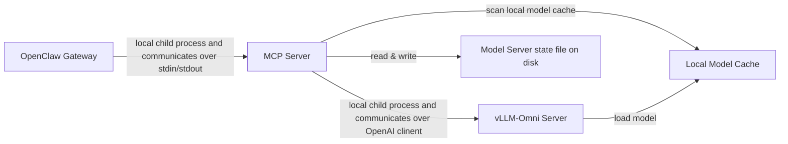
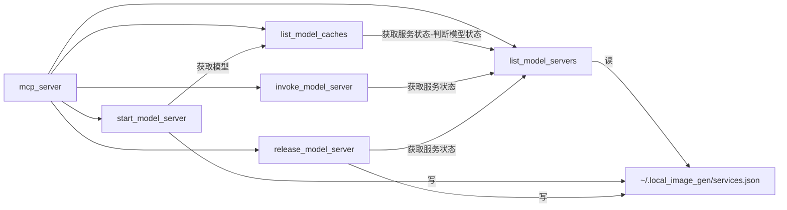

# 02 — Architecture: shorturl

Built from a signed-off `01-requirements.md`. References back to requirement IDs use the long form ("functional requirement FR-1", "non-functional requirement NFR-3") in prose; the short ID alone is fine inside tables.

## 1. Architecture diagram




## 2. Module list

| # | Module | One-line purpose | Status |
|---|--------|------------------|--------|
| 1 | `mcp_server` | mcp server启动脚本 | new |
| 2 | `list_model_caches` | 列举本地模型缓存 | new |
| 3 | `list_model_servers` | 列举本地模型服务 | new |
| 4 | `start_model_server` | 启动本地模型服务 | new |
| 5 | `invoke_model_server` | 调用本地模型服务 | new |
| 6 | `release_model_server` | 释放本地模型服务 | new |

## 3. Per-module public interface

### 3.1 `list_model_servers`

**Purpose:** 根据`~/.local_image_gen/services.json`的信息以及"http://127.0.0.1:{port}/v1/models"的返回值，列举本地模型服务，并维护`~/.local_image_gen/services.json`文件

**Interface:**
- `list_model_servers() -> list[dict]` 
  - Each entry: `{"PID": int, "PORT": int, "REPO_ID": str, "LOCAL_PATH": str, "STATUS": "loading" | "loaded"}`.
  - 轮询`~/.local_image_gen/services.json`，如果PID不存在，则删除这条记录。如果PID存在，则POST "http://127.0.0.1:{port}/v1/models"。如果POST返回结果，则STATUS为loaded，否则为loading。

### 3.2 `list_model_caches`

**Purpose:** 从modelscope缓存路径 `~/.cache/modelscope/hub/models` 列举本地模型缓存，并根据`~/.local_image_gen/services.json`的信息，

**Interface:**
- `list_model_caches() -> list[dict]` 
  - Each entry: `{"REPO_ID": str, "SIZE_ON_DIS": str, "LOCAL_PATH": str, "STATUS": "not_loaded" | "loading" | "loaded"}`.

**Dependencies on other modules:** `list_model_servers`.


### 3.3 `start_model_server`

**Purpose:** 根据 REPO_ID 启动模型服务，并将模型服务信息写入`~/.local_image_gen/services.json`

**Interface:**
- `start_model_server(repo_id: str) -> dict`
 - result: `{"PID": int, "PORT": int, "REPO_ID": str, "LOCAL_PATH": str}`
 - 如果list_model_servers返回数量 大于 0 ，则不启动新服务，提示caller release当前服务`{"PID": int, "PORT": int, "REPO_ID": str, "LOCAL_PATH": str, "STATUS": "loading" | "loaded"}`之后再restart
 - 如果repo_id不存在与list_model_caches，则提示repo id不存在
 - 如果启动成功，则再`~/.local_image_gen/services.json`中写入一条新的`{"PID": int, "PORT": int, "REPO_ID": str, "LOCAL_PATH": str}`

**Dependencies on other modules:** `list_model_caches`.

### 3.4 `invoke_model_server`

**Purpose:** 调用本地模型服务，并将生成图片保存在本地

**Interface:**
- `invoke_model_server(prompt: str, filename: str, ...) -> None`
  - `prompt` (required) — image generation / edit prompt. Empty string is a validation error.
  - `filename` (required positional; v12.5 — no default, second positional after `prompt`). Resolution:
    - **Parent directory must already exist** on disk. If `Path(filename).parent` does not exist → reject `filename_dir_not_found` (HTTP 400-shaped, no vllm-omni contact). The tool never creates parent directories (owner decision 2026-07-01T00:19). If the parent exists but is not writable → `media_dir_unwritable` (HTTP 500-shaped) with the underlying `OSError` errno.
    - **Target paths** are computed by splitting `filename` into `<stem>` / `<ext>` via `Path(filename).stem` / `.suffix`. For `count=1` the target is `<filename>`. For `count=N>1` the targets are `<stem>-1.<ext>`, `<stem>-2.<ext>`, …, `<stem>-N.<ext>` (no zero-padding). All targets are checked against disk before vllm-omni is contacted; any existing target → `filename_conflict` (HTTP 400-shaped).
  - `repo_id` (optional) — the desired model's HF-style repo name; **defaults to whichever service is currently running** under v1's single-service invariant. If supplied, the tool verifies the running service's `model` field matches and returns `model_not_loaded` on mismatch (no auto-start).
  - `image` (optional) — single reference image path/URL for edit (img2img / inpainting); sent as the `image` multipart field for `/v1/images/edits` (POC-confirmed field name).
  - `images` (optional) — list of reference image paths/URLs for edit or style reference; sent as the `image[]` multipart fields for `/v1/images/edits` (POC-confirmed field name; alias `image_array` also accepted).
  - `size` (optional) — `WxH` literal matching vllm-omni's wire protocol, e.g. `"1024x1024"`, `"1152x896"`, `"1280x720"`. The tool does **not** pre-validate the value — the specific valid set depends on the running model and vllm-omni returns 4xx for unsupported sizes. For Z-Image-Turbo the canonical default is `"1024x1024"`.
  - `outputFormat` (optional, default `"png"`) — `"png"` | `"jpeg"` | `"webp"`. vllm-omni's `/v1/images/generations` only supports `response_format: b64_json` regardless of `outputFormat`; the `outputFormat` value controls the **decoded bytes** format returned to the caller. `/v1/images/edits` has a native `output_format` parameter; the tool forwards the same value there.
  - `count` (optional, default 1) — image count 1-N. Under v1 single-service invariant, multiple images are produced serially by the same service and returned together in a single response. Response shape is `{path: list[str] (len=count), b64_json: list[str] (len=count)}` when `count>1`, and `{path: str, b64_json: str}` when `count=1`.
  - `negative_prompt` (optional, default `None`) — text describing what to avoid in the image. Forwarded verbatim to vllm-omni as the `negative_prompt` field on both endpoints. Type: string. When `None`, the field is omitted and the model uses its own default.
  - `num_inference_steps` (optional, default `None`) — number of diffusion steps. Forwarded verbatim as `num_inference_steps` on both endpoints. Type: integer. When `None`, the field is omitted and the model uses its own default.
  - `guidance_scale` (optional, default `None`) — classifier-free guidance scale; typical range documented as `0.0–20.0`, but the tool does **not** enforce that range. Forwarded as `guidance_scale` on both endpoints. Type: float. When `None`, the field is omitted and the model uses its own default.
  - `true_cfg_scale` (optional, default `None`) — True CFG scale. **Model-specific** — vllm-omni documents this as "may be ignored if not supported". Forwarded verbatim as `true_cfg_scale` on both endpoints. Type: float. When `None`, the field is omitted and the model uses its own default.
  - `seed` (optional, default `None`) — random seed for reproducibility. Forwarded verbatim as `seed` on both endpoints. Type: integer. When `None`, the field is omitted and the model uses its own default.

### 3.5 `release_model_server`

**Purpose:** 释放本地模型服务，删除`~/.local_image_gen/services.json`相关记录
**Interface:**
- `release_model_server(pid: int) -> None`

### 3.6 `mcp_server`

**Purpose:** mcp server启动脚本（stdio模式）

**Interface:**
- `python -m mcp_server.py` — 启动mcp server.

**Dependencies on other modules:** `list_model_caches` , `list_model_servers` ，`start_model_server`, `invoke_model_server`, `release_model_server`


## 4. Inter-module connections



## 5. Project directory tree

```
project/
├── scripts/
│   ├── list_model_servers.py             [NEW]
│   ├── list_model_caches.py                 [NEW]
│   ├── start_model_server.py                      [NEW]
│   ├── invoke_model_server.py                  [NEW]
│   ├── release_model_server.py                  [NEW]
│   └── mcp_server.py                      [NEW]
└── tests/
    ├── unit/
    │   ├── test_list_model_servers.py         [NEW]
    │   ├── test_list_model_caches.py  [NEW]
    │   └── test_start_model_server.py             [NEW]
    │   └── test_invoke_model_server.py             [NEW]
    │   └── test_release_model_server.py             [NEW]
    │   └── test_mcp_server.py       [NEW]
    └── integration/
        └── test_mcp_server.py       [NEW]
```

## 6. Tech stack

| Concern | Choice | One-sentence rationale |
|---------|--------|------------------------|
| Language | Python 3.12 | matches vllm requirement |
| vllm/vllm-omni | 0.22.0 | latest version |
| cuda | 13.3| latest version |

## 7. Cross-cutting decisions

## 8. Risks

| Risk | Likelihood | Mitigation |
|------|------------|------------|